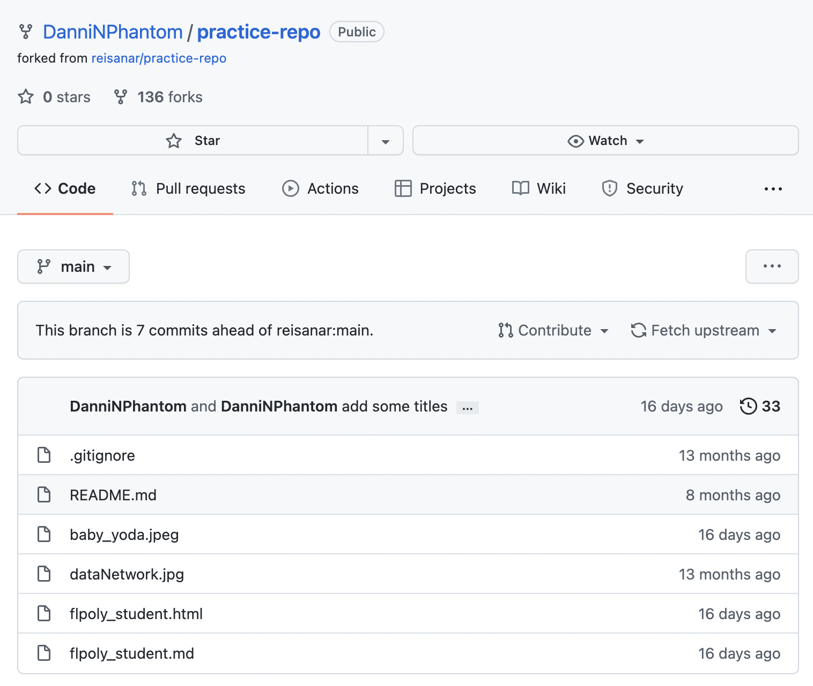

# Problem 1 (20 points)

During class you completed an activity in which you practiced `git` commands and operations (such as forking a repository, cloning it using `git clone`, and uploading changes using `git push`).

In this exercise you will used **markdown** tools discussed in class. 

## Part A

You must **create a table** that shows the courses you are currently enrolled in, using the following for the headers of the table: 

- Prefix: in bold letters (such as **COP**)
- Number: in bold letters (such as **2073**)
- Name: in italics (such as _Introduction to Data Science_)
- Credits (such as 3)
## Course Currently enrolled in

| **Course Prefix** | **Number** |   **Course Name**        | **Credit** |
|:-----------------:|:----------:|:------------------------:|:----------:|
| **IDC**           | **4943**   |_Data Analytic Capstone 2_| 3          |
| **GEB**           | **3373**   |_International Business_  | 3          |
| **COP**           | **2073**   |_Intro. to Data Science_  | 3          |
| **MAN**           | **4594**   |_Reverse Logistics_       | 3          |
| **MAN**           | **4633**   |_Strategic Management_    | 3          |

## Part B


Take a screenshot of the GitHub repo you used in HW 01, add the screenshot file to the repo, and include it in this document (review how to insert a picture using markdown).




# Problem 2 (30 points)

For this problem, you are asked to create a list of **4 concepts** you have learned about so far this semester. Include the name of the course as a sub-heading (that is, using `##`), and the concepts as an unordered list. Include a link to information about _at least one_ of the concepts you listed (for example a link to the Wikipedia page about that concept/topics).

_Edit this `.Rmd` file to include the solutions here._

## Strategic Management

-Analytical Tools

## Reverse Logistics

-Reverse Logistic Management (Gate keeping, Outsourcing) 

-Distinguished the different between Forward and Reverse

-Learning the Reverse Logistic Process[Prologis](https://www.prologis.com/what-we-do/resources/process-challenges-of-reverse-logistics#:~:text=The%20reverse%20logistics%20process%20usually,or%20resale%2C%20recycling%20and%20disposal.&text=The%20returned%20items%20are%20then,the%20production%20of%20new%20devices.) 


# Problem 3 (25 points)
In this problem you will practice some basic R operations. Include solutions to each items by inserting a new R chunk of code (make sure you run the chunk so that the output is displayed)

(a) Create a variable called `my_name` that contains _your preferred name_.
```{r}
my_name<- "Danni Williams"
```
(b) Create a variable called `name_length` that holds how many letters are in `my_name`.
```{r}
name_length<-nchar(my_name)
print(name_length)
```
(c) Show which value is bigger: $e^\pi$ or $\pi^e$. (Use the correct expressions for Euler's constant $e$ and the irrational number $\pi$ in R)
```{r}
max(exp(1)^pi, pi^exp(1))
```
(d) Use the colon operator `:` to create a vector `v` of numbers from 31 to 86. Find the length of this vector using the `length()` function.
```{r}
'v' <- 31:86 #Creating a vector
length(v) #finding the length of the vector
print(v) #print the vector from 31 to 86
```

(e) Use the `seq()` function to produce a range of number from -5 to 10 in 0.5 increments.

```{r}
seq(-5,10, by = 0.5)
```

# Problem 4 (25 points)

(a) (10 points) Define a function `imperial_to_metric` that takes in **two arguments**: a number of feet and a number of inches. The function should return the equivalent length in meters

> To convert a length `L` from feet (`ft`) and inches (`inches`) to meters (`m`), one can use the relation: `L(m) = L(ft) × 0.3048 + L(inches) × 0.0254`

```{r}
imperial_to_metric <- function(ft, inch){
return(((ft*0.3048)+inch)*0.0254)
}
```
(b) (5 points) Create a variable `height_in_meters` by passing your height in imperial to the `imperial_to_metric` function.
```{r}
height_in_meters <- imperial_to_metric(5,8)
print(height_in_meters)
```

(c) (5 points) Evaluate `round(3.1415)`, `factorial(12)`, `mean(1:17)`.
```{r}
round(3.1415)
factorial(12)
mean(1:17)
```

(d) (5 points) Create an object named `die` that contains the numbers one through six. Simulate a roll of the die with `R`’s `sample()` function. 
```{r}
die <- 1:6 # create a Vector name die
sample(die,1) 

```


